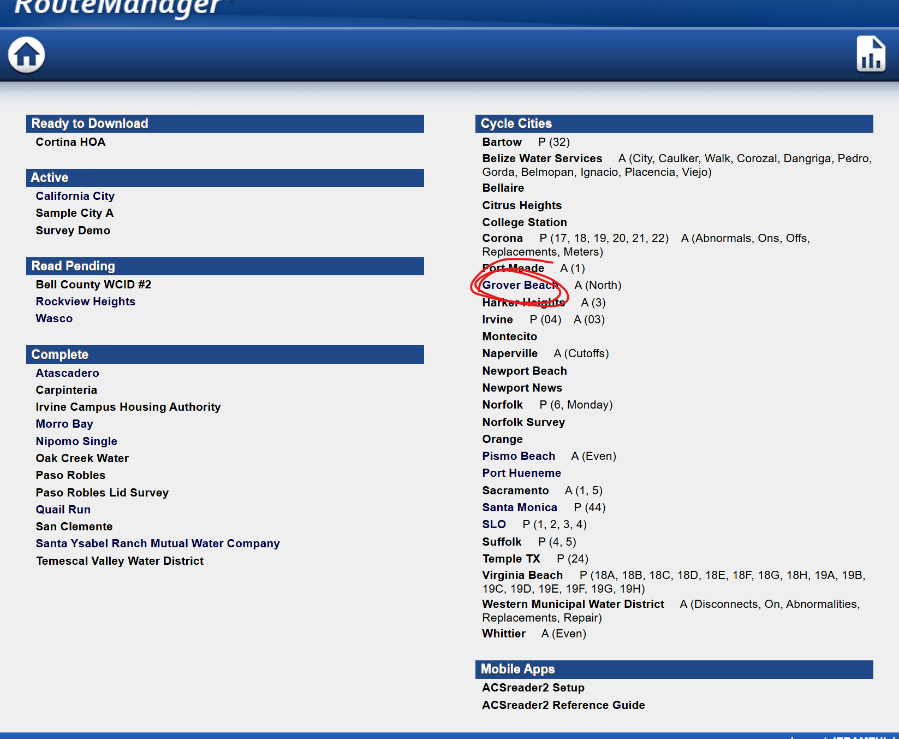

# Workflow on Alexander’s Website

STEP 1:

This is the homepage. I select a city, in this example I will select Grover Beach circled in red.

STEP 2:

It brings me to the city’s homepage and i will select the route manager icon circled in red.

STEP 3:

This is the route assigning page. The list of readers is circled in green. Once i select a reader from green section they will move to yellow section. When I select a reader loaded in yellow section, i then select a route from orange section below to assign them to. This is done by clicking the checkbox associated with each route. 

STEP 4:

Returning to the city’s homepage, any meters that have an unusually high or low reading will require the reader to take a picture of the meter. That picture shows up in the section circled in red. Specifically where the “71” is located. 

STEP 5:

After clicking on “71” I can see where all 71 of these meters requiring my approval are. They appear in order and I must go through each one one at a time. (Note the usage history from previous months on the bottom. As well as the info box on the right.) From here I can choose either “Reread” or “approve”. Reread option sends it to another page (The “4” in the city’s homepage.) and I can from there assign it to a reader to go recheck it, or assign it to myself. Hitting “approve” simply allows it to pass on to the city for review. Also note that on the right side, I can edit the read of “760” in the text box in case it does not match the photo. 

STEP 6:

If I were to select the “4 to reread” on the city’s homepage it will bring me to this screen that has a list of the four meters that need to be reread. Selecting one will bring me to a similar photo approval page from step 5. Selecting the icon circled in red will bring me to the next step

STEP 7:

It will bring me to this page. I only really use these two, circled in green and red respectively. 

Reader totals simply shows me a list of readers, how much theyve read and on which route. Green shows me a list of readers and at what times they have stopped reading for more than 10 minutes and at what time.